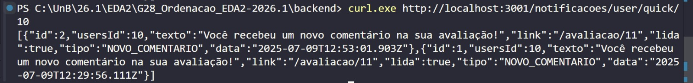
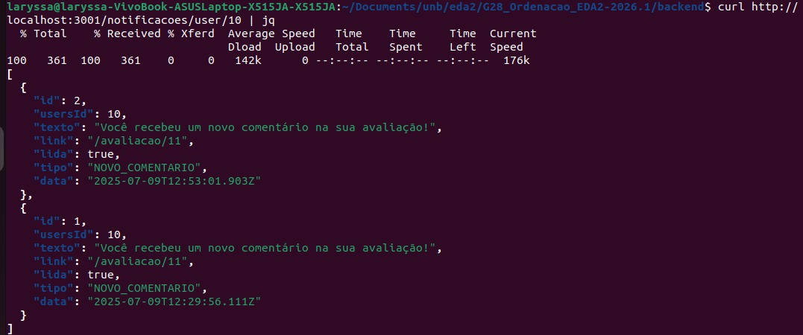
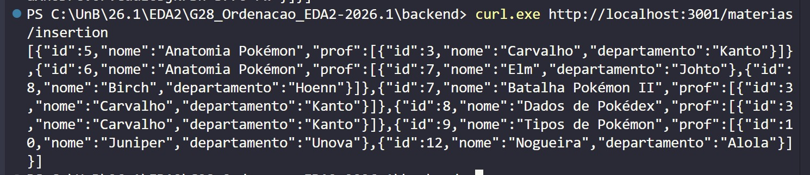
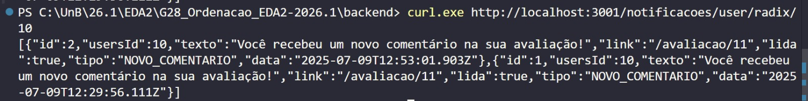
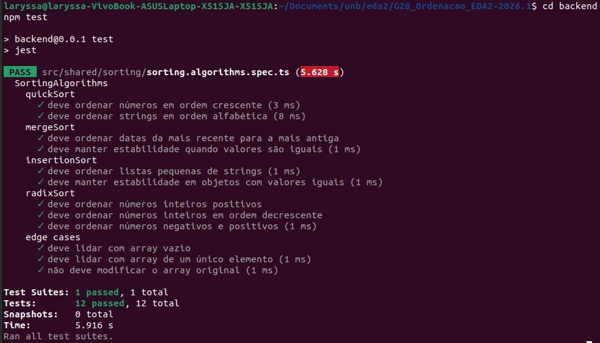

# Ordenação - Fui Com a Cara

Esse repositório tem como objetivo aplicar **algoritmos de ordenação** em um sistema de avaliação de professores como trabalho 2 da disciplina de Estruturas de Dados 2 da Universidade de Brasília, no semestre 26.1.  

A tecnologia utilizada no Fui Com A Cara foi majoritariamente **TypeScript**. 

## Alunas

| Matrícula | Nome |
| -- | -- |
| 231026840  | Laryssa Felix Ribeiro Lopes |
| 231035731 |  Mayara Marques Silva |

## Vídeo de Apresentação

[Link](link-TODO)

## Como rodar o projeto 

### Pré-requisitos
- Node.js (v18+)

### Rodando o Backend

1. Navegue até a pasta do backend:
```bash
cd G28_Ordenacao_EDA2-2026.1/backend
```

2. Crie um arquivo `.env` na raiz da pasta backend com as seguintes variáveis:
```env
JWT_SECRET="sua_chave_secreta_muito_segura_aqui_minimo_32_caracteres"
DATABASE_URL="file:./dev.db"
PORT=3001
NODE_ENV="development"
```

> **Nota**: O `JWT_SECRET` deve ter no mínimo 32 caracteres por segurança. Gere uma chave forte se possível.

3. Instale as dependências:
```bash
npm install
```

4. Configure o banco de dados (gere o cliente Prisma e aplique as migrations):
```bash
npx prisma generate
npx prisma migrate deploy
```

5. Inicie o servidor:

```bash
npm run start:dev
```

O servidor estará disponível em `http://localhost:3001`

### Rodando o Frontend

1. Em uma **nova aba do terminal**, navegue até a pasta do frontend:
```bash
cd G28_Ordenacao_EDA2-2026.1/frontend
```

2. Instale as dependências:
```bash
npm install
```

3. Inicie o servidor de desenvolvimento:
```bash
npm run dev
```

O frontend estará disponível em `http://localhost:3000`

## Algoritmos de Ordenação utilizados

- QuickSort: implementação simples, com pivô sendo o último elemento, recursiva e sem otimizações adicionais.
- MergeSort: implementação estável para ordenações que exigem estabilidade (mantém ordem relativa de chaves iguais).
- InsertionSort: algoritmo incremental e estável, adequado para listas pequenas ou quase ordenadas.
- RadixSort: algoritmo não comparativo para números inteiros (suporta positivos e negativos).

### Explicações

#### QuickSort

- Complexidade: tempo médio O(n log n), pior caso O(n²).
- Espaço: O(log n) adicional devido à recursão na implementação atual.
- Propriedades: não estável por padrão.
- Observações sobre a implementação atual:
   - Pivô: o algoritmo usa o último elemento do subarray como pivô.

Motivação: o `quickSort` é adequado para ordenações gerais por campos textuais (ex.: nome) e é um bom ponto de partida para discussões sobre tempo de execução.

#### MergeSort

- Complexidade: O(n log n) tempo no melhor, médio e pior caso.
- Espaço: O(n) adicional.
- Propriedades: estável.

Motivação: foi o escolhido para ordenações que exigem estabilidade, por exemplo quando ordenamos por data mantendo a ordem original quando chaves são iguais (ex.: avaliações com mesma data/horário).


#### InsertionSort

- Complexidade: O(n²) no pior caso, O(n) no melhor caso (entrada já quase ordenada).
- Espaço: O(1) adicional — operação in-place na forma implementada.
- Propriedades: estável.

Motivação: `InsertionSort` é útil quando os arrays são pequenos ou já quase ordenados. No Fui com a Cara a implementação serve como referência para comparar overheads práticos e também como alternativa de baixo custo para listas pequenas. Foi escolhido pela sua fácil implementação.

#### RadixSort

- Complexidade: O(n * k), onde `k` é o número de dígitos a processar.
- Espaço: O(n + b) adicional, onde `b` é a base usada, no nosso caso, 10 (base decimal).

Motivação: `RadixSort` é apropriado para ordenar inteiros (IDs, chaves numéricas) e costuma superar algoritmos por comparação quando `k` é pequeno em relação a `log n`. A implementação no Fui com a Cara trata números negativos separando positivos e negativos e recompondo-os, portanto é adequada para vetores de inteiros usados em testes ou ordenação de IDs. 

### Justificativa de uso

   - Performance (tempo): QuickSort para listas gerais onde a média importa.
   - Estabilidade: MergeSort quando a ordem relativa deve ser preservada.
   - Simplicidade/overhead: InsertionSort para pequenas partições.

### Screenshot

# Demonstração dos Algoritmos de Ordenação

## QuickSort
  
Implementação baseada em divisão e conquista (*divide and conquer*).



---

## MergeSort

Algoritmo estável utilizado para ordenação de avaliações e notificações por data.


---

## MergeSort no Terminal

Execução e validação do MergeSort integrado ao backend de notificações.



---

## InsertionSort

Algoritmo utilizado para ordenação de listas pequenas, como matérias no modal de avaliação.



---

## RadixSort

Algoritmo não comparativo utilizado para ordenação numérica por ID.



---

## Testes dos Algoritmos

Execução dos testes unitários e validação dos algoritmos implementados.


